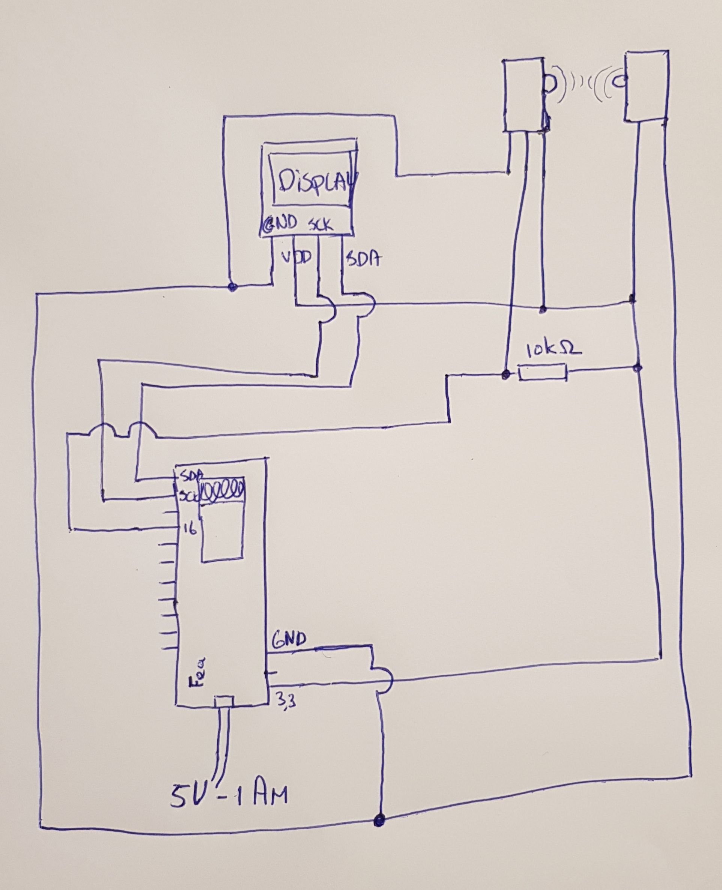
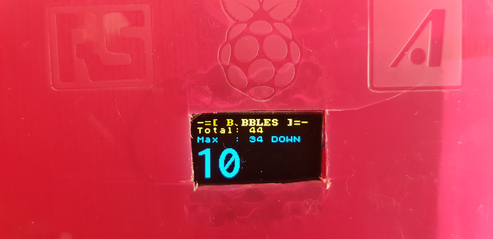
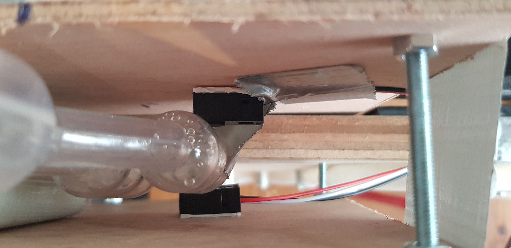
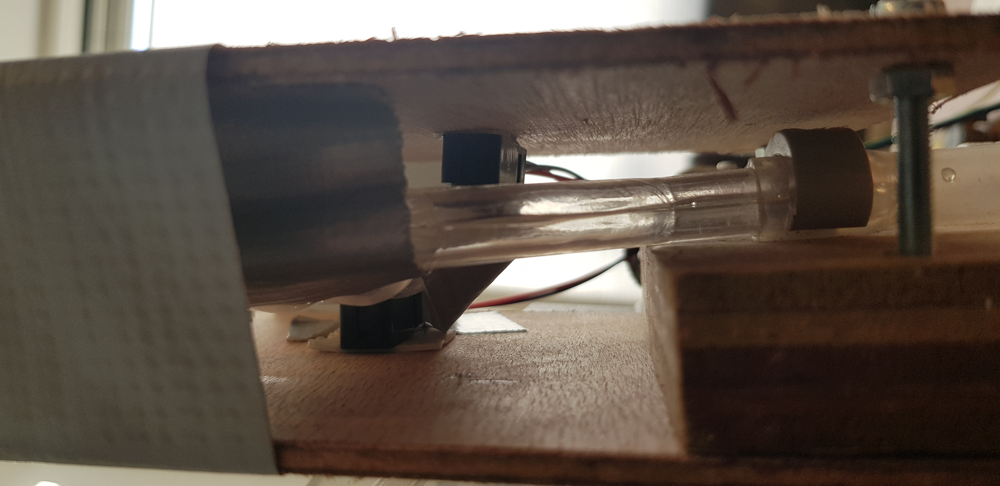
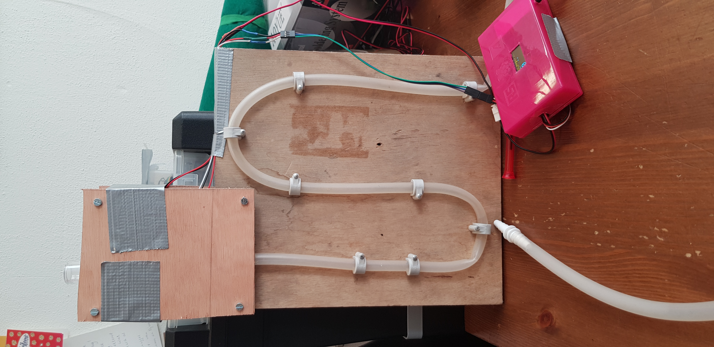

# Project - Bubble counter with a display - ESP8266

Using:
- adafruit-feather-huzzah-esp8266 [ref](https://learn.adafruit.com/adafruit-feather-huzzah-esp8266/overview) ~20 euro
- ir-breakbeam-sensors [ref](https://learn.adafruit.com/ir-breakbeam-sensors/arduino) ~3 euro
- display (Seriële Witte OLED Display Module 128X64 I2C SSD1306 12864 Lcd-scherm) ~1,66 euro
- beer fermentation airlock [ref example](https://www.braumarkt.com/waterslot-bolletjesmodel) ~
- tube
- wood
- plastic box 
- printplate

## Description

With this project you can measuring the fermentation bubbles. Every 60 secs, the actually bubble count has been saved in an array. The length of the array is 60. (60 times 60 is 1 Hour). After an hour the counter array start on zero. So there will keep measuring of 1 hour of bubbles. Every 60 seconds there is a check if the max count bubble in hour has been made. This is the peek in you fermentation scope. With the current 60 seconds count you see if the fermentation is finished.

For this project you have to know how you can solder electrical components. With the schema and the photo you can create your own bubble counter. 

## Schema

The project is made with the following schema. On the right side the ir-breambeam sensors connected with the white kabel to the 10kOhm resistor and pin 16 of the feather. The powersupply comes from the feather pin (3.3V).

## Case with the display

|Name|Description|
|--|--|
|Title | -=BUBBLES=-|
|Total | All counted bubbles when the arduino starts
|Max   (U/D) | Maximum SUM of all bubbles in a hour with measuring if its rizing or not U (Up) or D(Down)|
|COUNTER| Minute counter. Every minute its reset this value|

## IR-breakbeam sensor

The breakbeam sensor has been stick in a case with the air lock. This is for external light and solid layer. Before connected to the fermentor. For first use the sensors has to been calibrated before it counts the bubbles. 

## Total project

## Arduino code

### Librarie

- 8x8lib control the display [ref](https://github.com/olikraus/u8g2/wiki)

## Future requirement

- WIFI connection
- Temparature
- Connected to a open platform like (Ubidots)
